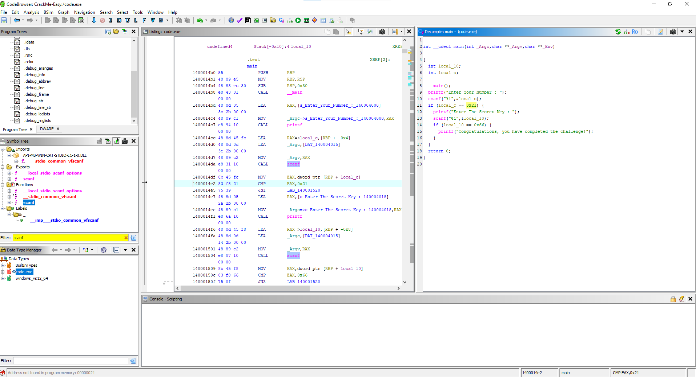
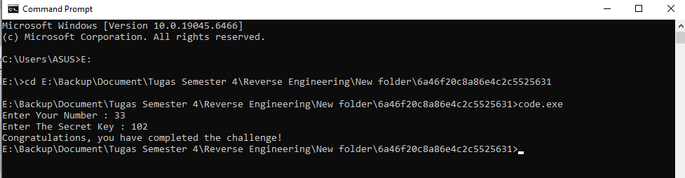

# Writeup Crackme-03: Analisis Logika Input `code.exe`

## Metadata
- **Nama**: RR7's Secret key 
- **Target**: `code.exe`
- **Tipe**: C++ Console Application
- **Arsitektur**: x86-64
- **Tools**: Ghidra
- **Difficulty**: 1.0 (Easy)
- **Sumber**: https://crackmes.one/crackme/6a46f20c8a86e4c2c5525631

## 1. Analisis Statis (Triage)
Pada tahap awal, file dieksekusi menggunakan *Static Analysis Tool* (Ghidra) untuk mengidentifikasi alur kerja program.
* **Metode**: Dekompilasi *binary* menjadi kode representatif bahasa C.
* **Temuan Awal**: Program menggunakan fungsi standar `printf` dan `scanf` untuk interaksi pengguna.

## 2. Bedah Logika (Ghidra Decompiler)
Hasil dekompilasi menunjukkan adanya dua tahap pengecekan input yang bersifat *hardcoded*:

## Proses dalam Ghidra   

Berdasarkan kode di atas, ditemukan logika berikut:
1. **Input Pertama**: Harus bernilai `0x21` (heksadesimal) atau **33** (desimal).
2. **Input Kedua**: Harus bernilai `0x66` (heksadesimal) atau **102** (desimal).

## 3. Hasil Eksekusi (Dinamis)
Setelah mengetahui nilai yang diharapkan, dilakukan pengujian melalui *Command Prompt* untuk memverifikasi temuan:

## Hasil eksekusi melalui command prompt

<<<<<<< HEAD
Program berhasil mengeluarkan pesan *"Congratulations, you have completed the challenge!"* setelah input **33** dan **102** dimasukkan secara berurutan.

## 4. Kesimpulan
Tantangan ini mengajarkan dasar-dasar *reverse engineering* di mana analis harus mampu melakukan konversi nilai antara heksadesimal ke desimal serta membaca alur logika program melalui dekompilator. Tantangan ini berhasil diselesaikan dengan metode analisis statis yang dikonfirmasi dengan pengujian dinamis.
=======
## Kesimpulan
Analisis statis melalui Ghidra sangat efektif untuk menemukan logika perbandingan angka, dan eksekusi melalui *command prompt* mengonfirmasi validitas analisis tersebut.
