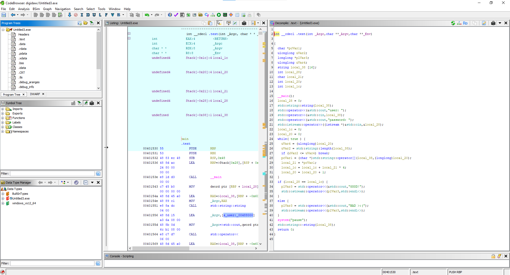
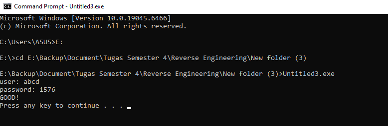

# Write-up: Reverse Engineering "Untitled3.exe"

## Summary
Tujuan dari tantangan ini adalah untuk mengidentifikasi algoritma validasi *input* pengguna dan membuat sebuah *keygen* sederhana. Program menerima `username` dan `password` sebagai *input*, kemudian melakukan kalkulasi aritmatika untuk memverifikasi kecocokan keduanya.

## Metadata
- **Nama**: Dojas's MEDIUM
- **Target**: `Untitled3.exe`
- **Tipe**: C++ Console Application
- **Arsitektur**: x86-64
- **Tools**: Ghidra
- **Sumber**: https://crackmes.one/crackme/6167747a33c5d4329c345148

## Analisis Statis
Berdasarkan hasil dekompilasi menggunakan Ghidra, program diinisialisasi dengan dua variabel utama untuk menampung *input* pengguna: `local_38` (untuk *username*) dan `local_28` (untuk *password*).


## Proses dalam Ghidra   


## Identifikasi Struktur Program
Berdasarkan analisis *decompiler*, program ini adalah aplikasi konsol berbasis C++ yang menggunakan *standard library* (`iostream`) untuk interaksi pengguna. Struktur utama program dapat dirangkum sebagai berikut:

- **Inisialisasi**: Program mengalokasikan memori untuk `std::string` guna menampung *username* dan tipe `int` untuk *password*.
- **Input**: Program menggunakan `std::cin` untuk menerima masukan *username* dan *password* dari pengguna.
- **Logika Utama**: Program melakukan iterasi pada *input string* untuk menghitung nilai komputasi yang akan dibandingkan dengan *password*.

## Analisis Algoritma (Reverse Engineering)
Melalui pembacaan kode *decompiler*, ditemukan bahwa validasi tidak dilakukan dengan membandingkan *password* secara statis, melainkan melalui kalkulasi dinamis.

### Pseudocode Algoritma
```cpp
// Representasi logika program dalam bentuk pseudocode
int calculate_checksum(string username) {
    int checksum = 0;
    for (int i = 0; i < username.length(); i++) {
        // Setiap karakter dikalikan 4 dan ditambahkan ke total
        checksum += (int(username[i]) * 4);
    }
    return checksum;
}

// Logika Validasi
if (input_password == calculate_checksum(input_username)) {
    print("GOOD!");
} else {
    print("BAD >:(");
}

## Verifikasi Eksekusi Program
Setelah memahami algoritma validasi melalui analisis statis, dilakukan verifikasi *input* langsung pada aplikasi untuk mengonfirmasi temuan.

### Skenario Pengujian
Pengujian dilakukan dengan menggunakan *username* `"abcd"` untuk memicu kalkulasi *password* yang telah ditentukan.

### Hasil Eksekusi
Berdasarkan tangkapan layar di bawah ini, program berhasil menerima *input* dan memproses validasi dengan hasil sukses:

```text
user: abcd
password: 1576
GOOD!
Press any key to continue . . .

## Hasil eksekusi melalui command prompt


