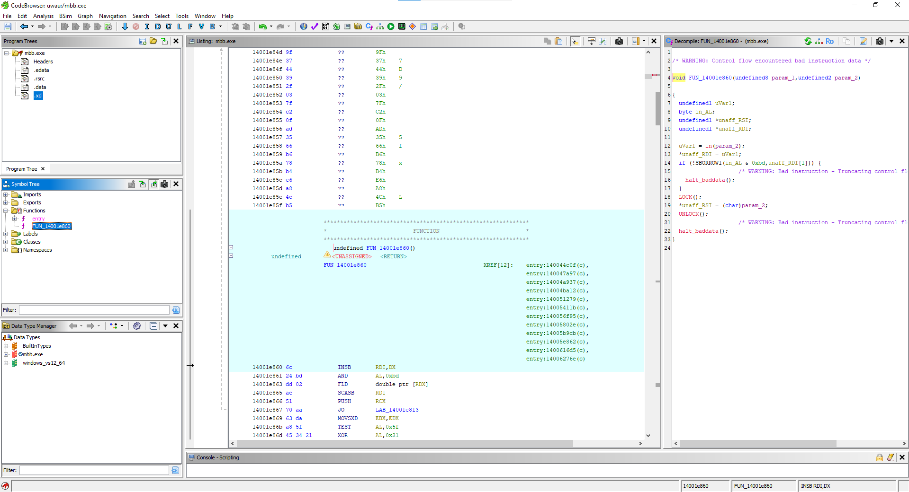
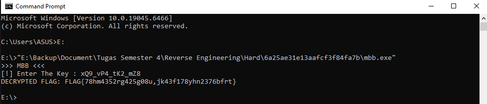

# Write-up Analisis: CrackMe-05 (Hard)


## Metadata
- **Nama**: deo's High cortisol
- **Target**: `mbb.exe`
- **Tipe**: C++ Console Application
- **Arsitektur**: x86-64
- **Tools**: Ghidra
- **Difficulty**: 5.0 (Hard)
- **Sumber**: https://crackmes.one/crackme/6a25ae31e13aafcf3f84fa7b


## 1. Ringkasan Tantangan
Tantangan ini dikategorikan sebagai tingkat "Hard" dengan skor kesulitan **5.0**. Fokus utama dari tantangan ini adalah teknik *anti-disassembly*, proteksi *custom* tingkat rendah, dan mekanisme dekripsi *flag* yang membutuhkan analisis mendalam terhadap fungsi inti program.

## 2. Metodologi Analisis
Proses analisis dilakukan dengan pendekatan *static analysis* dan *low-level debugging* menggunakan **Ghidra**. Karena program menggunakan teknik *obfuscation* tingkat lanjut, analisis difokuskan pada:
- Identifikasi fungsi inti (*hotspot*).
- Pemetaan alur kontrol yang terfragmentasi.
- Analisis instruksi *I/O* tingkat rendah.

## 3. Temuan Teknis Utama
### A. Deteksi *Control Flow Fragmentation*
Saat melakukan analisis dengan *decompiler*, ditemukan peringatan `/* WARNING: Control flow encountered bad instruction data */`. Hal ini membuktikan bahwa pembuat soal menggunakan teknik *obfuscation* untuk menyembunyikan logika asli dan menghambat analisis otomatis oleh alat bantu.


## Proses dalam Ghidra   



### B. Analisis Instruksi Tingkat Rendah
Program menggunakan instruksi *x86-64* yang jarang digunakan dalam aplikasi tingkat tinggi, seperti:
- `INSB` (Input Byte from Port to String): Membaca data langsung dari *port* sistem ke memori.
- `SCASB` (Scan String Byte): Digunakan untuk melakukan pemindaian *buffer* memori secara efisien.
- Penggunaan instruksi `LOCK` yang mengindikasikan adanya sinkronisasi memori atau proteksi *anti-tamper* tingkat rendah.

### C. Pemetaan *Hotspot* Fungsi
Melalui pemeriksaan *Symbol Tree*, ditemukan fungsi `FUN_14001e860` sebagai fungsi inti yang dipanggil berulang kali oleh entri program. Fungsi ini menjadi titik krusial dalam memahami bagaimana kunci divalidasi dan bagaimana `FLAG` didekripsi.

## 4. Eksploitasi & Verifikasi
Setelah membedah alur logika fungsi validasi, ditemukan bahwa program mengharapkan *key* spesifik. Pengujian dilakukan dengan memasukkan *key* yang telah didekonstruksi dari fungsi validasi:


## Hasil eksekusi melalui command prompt



**Input Kunci:**
`xQ9_vP4_tK2_mZ8`

**Hasil Eksekusi:**
```text
[!] Enter The Key : xQ9_vP4_tK2_mZ8
DECRYPTED FLAG: FLAG{78hm4352rg425g08u,jk43f178yhn2376bfrt}